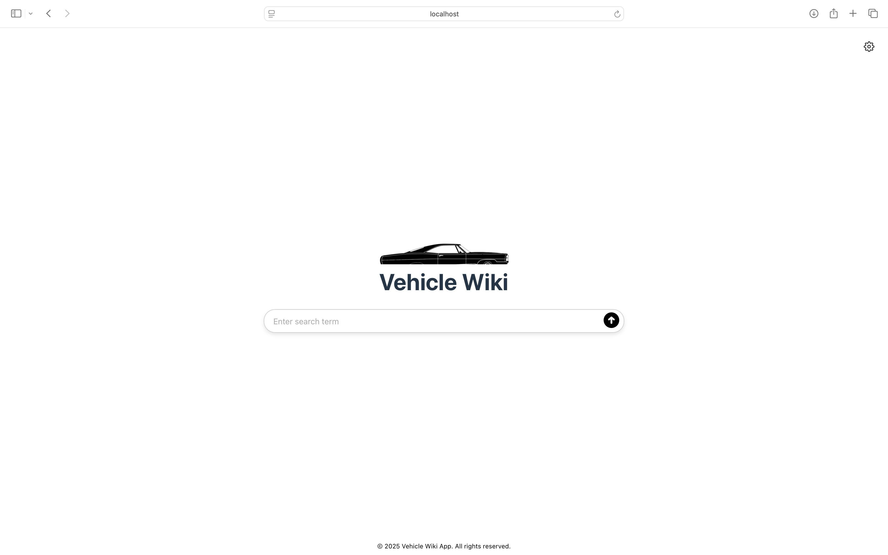
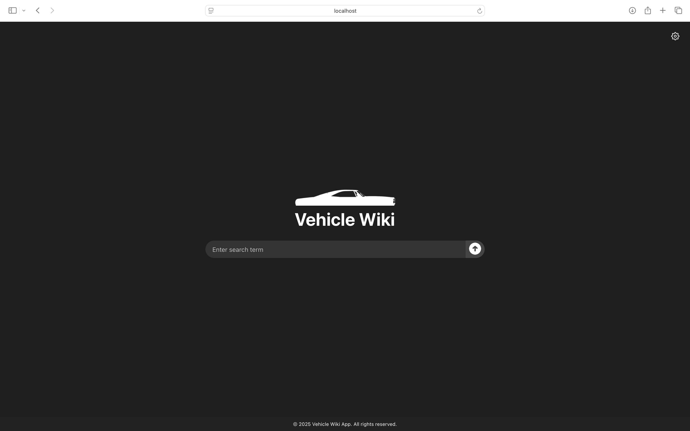
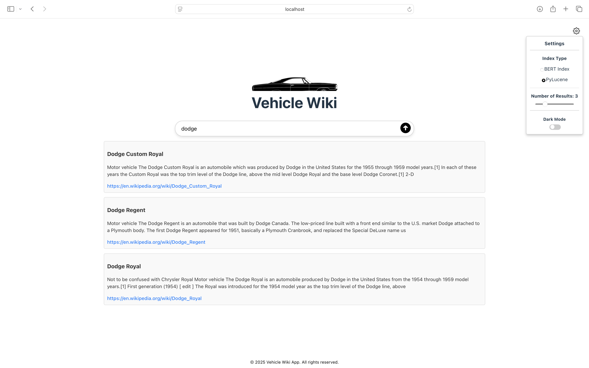
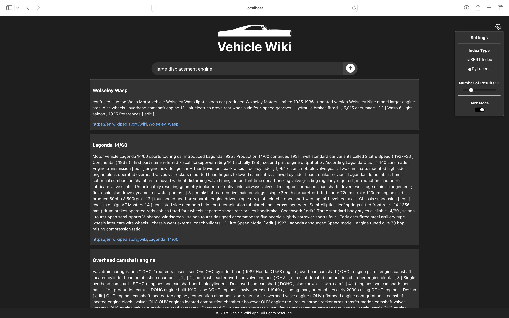
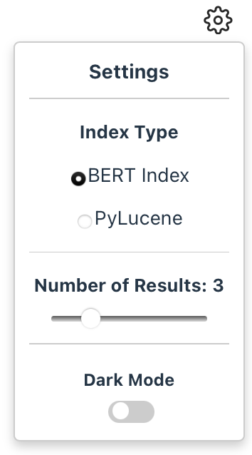

# Vehicle-Wiki-Web-App

Welcome to the **Vehicle Wiki Web App**! This application allows you to search and compare vehicles using advanced machine learning models and search engines. The app supports two methods for efficient vehicle retrieval: **Faiss** and **PyLucene**.

Home screen shown in light mode (left) and dark mode (right)

 

Query output using PyLucene Index in light mode (left) and query output using BERT Index in dark mode (right)

 


---

## Features

### Minimalistic User Interface
The web application boasts a sleek and intuitive user interface, designed to minimize distractions and enhance user experience.


Placeholder for screenshot of the main user interface with the title and search bar.

Upon opening the app, users are greeted with a centered title and a simple search bar. A small settings icon is located in the top-right corner, providing access to advanced features without cluttering the main view.

### Settings Menu
The settings menu houses all additional features, designed for ease of use and customization.




- #### Indexing Method Selection
  Users can select between BERT Indexing and PyLucene Index with a simple toggle. The default method is BERT Indexing via FAISS.

- #### Adjust Search Results Display
  A slider enables users to choose the number of displayed search results, from one to ten, with a default of three results.

- #### Dark Mode Toggle
  A dark mode toggle offers users the ability to switch to a dark-themed interface, optimizing visibility in low-light conditions.


## Installation

1. Clone this repository:
   ```bash
   git clone https://github.com/Demetreous/Vehicle-Wiki-Web-App.git
   cd Vehicle-Wiki-Web-App
   ```
2. Install dependencies:
   ```bash
   nvm install node
   pip install flask fastapi uvicorn faiss-cpu transformers torch paramiko pydantic

   ```
3. Download the necessary large files from the GitHub releases:
   - Faiss-based Approach Release:
       - faiss_index.bin: Pre-processed Faiss index for fast vehicle search.
       - filtered_embeddings.pkl: Filtered vehicle embeddings for comparison.
   - PyLucene-based Approach Release:
       - PyLucene index files: For searching and comparing vehicles using PyLucene.
4. Place the downloaded files in the backend/ directory:
   - For the Faiss-based approach, move the Faiss files (e.g., faiss_index.bin, filtered_embeddings.pkl) to the backend/ directory.
   - For the PyLucene-based approach, move the PyLucene index files to the backend/ directory or the Bolt server if you are a UCR student. If running locally, modify the code accordingly to reference the local directory.
  
## Running the Application
Once the files are in place, run the app using:
```bash
./start.sh
```
